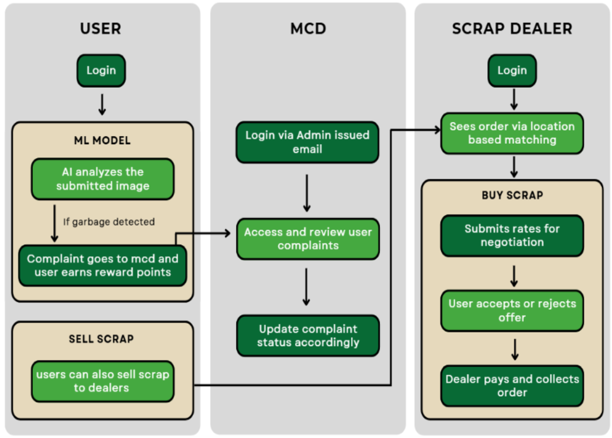

**Team Name:** Tree.io </br>
**Team ID:** 101449

**Team Leader:** [@Dhruv](https://github.com/Dhruv-Tuteja)

**Team Members:**

- **MEMBER_1** - 2023UIN3332 - [@Dhruv](https://github.com/Dhruv-Tuteja)
- **MEMBER_2** - 2023UCS1548 - [@Nayan](https://github.com/NASA12345)
- **MEMBER_3** - 2023UCA1804 - [@Tushar](https://github.com/TusharSachdeva29)
- **MEMBER_4** - 2023UCA1869 - [@Jai](https://github.com/JaiBansal007)
- **MEMBER_5** - 2023UCA1728 - [@Yashaswini](https://github.com/Yashaswini-Sharma)
- **MEMBER_6** - 2023UCA1600 - [@Rohan](https://github.com/RohanJ26)

## Project Links

- **SIH Presentation:** [Final SIH Presentation](docs/SUDHAAR.pdf)
- **Video Demonstration:** [Watch Video](https://youtu.be/wS1blRJtoGY)
- **Source Code:** [GitHub Repository](https://github.com/JaiBansal007/Sudhar-App)

# Sudhaar App 🌟

## 📖 Overview

**Sudhaar** (meaning "improvement" in Hindi) is a comprehensive digital platform designed to bridge the gap between various stakeholders in the public distribution and complaint management ecosystem. Built for the Smart India Hackathon, this Next.js application provides a unified solution for users, traders, municipal corporations, and administrators.

## 🏗️ System Architecture & Workflows

### System Workflow


*Complete system workflow showing the interaction between different user roles and system components*

### API Workflow


*Detailed API workflow diagram illustrating the backend processes and data flow*

## 🎯 Key Features

### 🔐 Multi-Role Authentication System
- **Users**: General public with complaint and service access
- **Traders**: Marketplace participants for buying/selling
- **MCD (Municipal Corporation)**: Service providers and complaint handlers
- **Admin**: System administrators with oversight capabilities

### 🤖 AI-Powered Complaint System
- **Image Recognition**: Uses TensorFlow.js and Teachable Machine for automated complaint categorization
- **Smart Classification**: Automatically identifies and categorizes complaints from uploaded images
- **Location-Based Reporting**: GPS-enabled complaint submission with precise location tracking

### 📱 Core Modules

#### For Users:
- **Complaint Management**: Submit, track, and manage complaints with AI assistance
- **Community Platform**: Connect with local community members
- **Marketplace**: Buy and sell products/services
- **Digital Wallet**: Secure transaction management
- **Profile Management**: Personal information and activity tracking

#### For Traders:
- **Inventory Management**: Track and manage product listings
- **Order Processing**: Handle customer orders efficiently
- **Wallet Integration**: Secure payment processing
- **Authentication System**: Secure login and profile management

#### For MCD:
- **Complaint Resolution**: Manage and resolve public complaints
- **Service Management**: Oversee municipal services
- **Administrative Tools**: Monitor and manage system operations

#### For Admins:
- **System Oversight**: Complete platform management
- **User Management**: Handle user accounts and permissions
- **Analytics Dashboard**: Monitor platform performance and usage

## 🛠️ Technology Stack

### Frontend
- **Next.js 14.2.8** - React-based framework with App Router
- **TypeScript** - Type-safe development
- **Tailwind CSS** - Utility-first CSS framework
- **Material-UI (MUI)** - React component library
- **React Hot Toast** - Beautiful notifications

### Backend & Database
- **Firebase 10.13.1** - Backend-as-a-Service
- **Firestore** - NoSQL document database
- **Firebase Authentication** - User authentication
- **Firebase Storage** - File storage and management

### AI & Machine Learning
- **TensorFlow.js** - Machine learning in the browser
- **Teachable Machine** - Image classification model
- **Custom ML Model** - Pre-trained model for complaint categorization

### Additional Libraries
- **EmailJS** - Email sending functionality
- **React Router DOM** - Client-side routing
- **Axios** - HTTP client for API requests
- **Multer** - File upload handling
- **bcrypt** - Password hashing
- **Nodemailer** - Server-side email functionality

## 🚀 Getting Started

### Prerequisites
- Node.js (v18 or higher)
- npm or yarn
- Firebase project setup

### Installation

1. **Clone the Repository**
   ```bash
   git clone https://github.com/JaiBansal007/Sudhar-App.git
   cd Sudhar-App
   ```

2. **Navigate to Code Directory**
   ```bash
   cd Code
   ```

3. **Install Dependencies**
   ```bash
   npm install
   # or
   yarn install
   ```

4. **Environment Setup**
   ```bash
   cp .env.example .env.local
   ```
   
   Fill in your Firebase configuration:
   ```env
   NEXT_PUBLIC_API_KEY=your_firebase_api_key
   NEXT_PUBLIC_AUTH_DOMAIN=your_project.firebaseapp.com
   NEXT_PUBLIC_PROJECT_ID=your_project_id
   NEXT_PUBLIC_STORAGE_BUCKET=your_project.appspot.com
   NEXT_PUBLIC_MESSAGE_SENDER_ID=your_sender_id
   NEXT_PUBLIC_APP_ID=your_app_id
   NEXT_PUBLIC_MEASUREMENT_ID=your_measurement_id
   ```

5. **Run Development Server**
   ```bash
   npm run dev
   # or
   yarn dev
   ```

6. **Open Application**
   Navigate to [http://localhost:3000](http://localhost:3000) in your browser.


## 🔧 Available Scripts

```bash
# Development
npm run dev          # Start development server

# Production
npm run build        # Build for production
npm start           # Start production server

# Code Quality
npm run lint        # Run ESLint
```

## 🤖 AI Model Integration

The application includes a pre-trained TensorFlow.js model located in `Public/my_model/` for intelligent complaint categorization:

- **Model Files**: `model.json`, `weights.bin`, `metadata.json`
- **Integration**: Seamless browser-based inference
- **Capabilities**: Real-time image classification and complaint categorization

## 🔐 Authentication Flow

The app supports multiple authentication methods:
- Email/Password authentication
- Google OAuth integration
- Role-based access control
- Secure session management

## 📱 Responsive Design

- Mobile-first approach
- Cross-platform compatibility
- Progressive Web App (PWA) ready
- Optimized for various screen sizes
